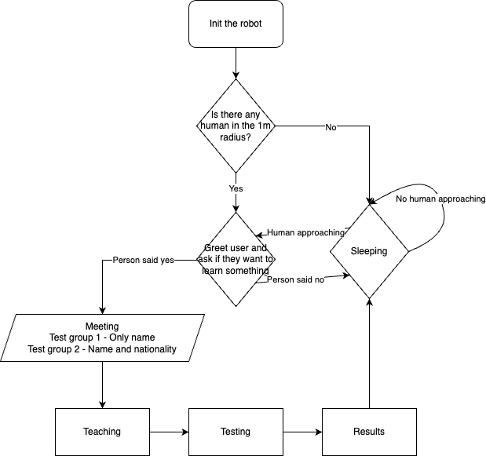

# Ethni-Furhat
A robot that can change it's ethnicity to be able to make people more comfortable and understand things easier.

## Flowchart

### Init

Initialize the robot and configure starting settings

### Sleeping

If there is no person to interact the robot will sleep and wait for anyone that would like to learn something!

### Greeting

Ethni-Furhat loves teaching! If it sees someone in 1.5-meter radius it will greet them and ask about if they would like to learn something.  

### Meeting

Ethni-Furhat will ask about some questions to know the person better.

#### Test case - 1

You'll be only asked for your name to personalize output and the interaction

#### Test case - 2

You'll be asked your name and nationality to give you more personalized experience. Based on your natiolality Ethni-Furhat's face, voice and the language will change.

### Teaching

The Ethni-Furhat will try to teach you some interesting stuff

### Testing

You'll be tested in order to understand if you learned what the Ethni-Furhat taught you or not 

### Results

Ethni-Furhat will share the test result with you and end the conversation. 

